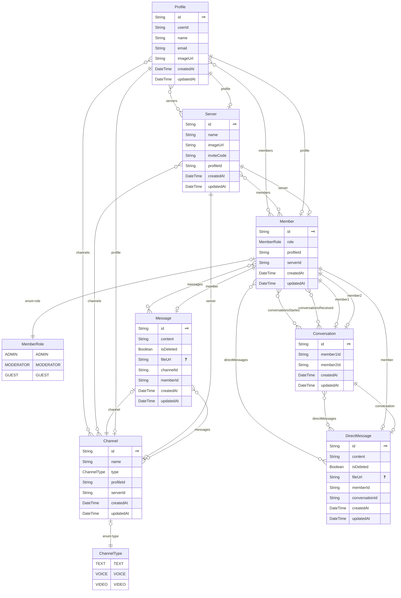

```mermaid
erDiagram

        MemberRole {
            ADMIN ADMIN
MODERATOR MODERATOR
GUEST GUEST
        }
    


        ChannelType {
            TEXT TEXT
VOICE VOICE
VIDEO VIDEO
        }
    
  "Profile" {
    String id "🗝️"
    String userId 
    String name 
    String email 
    String imageUrl 
    DateTime createdAt 
    DateTime updatedAt 
    }
  

  "Server" {
    String id "🗝️"
    String name 
    String imageUrl 
    String inviteCode 
    String profileId 
    DateTime createdAt 
    DateTime updatedAt 
    }
  

  "Member" {
    String id "🗝️"
    MemberRole role 
    String profileId 
    String serverId 
    DateTime createdAt 
    DateTime updatedAt 
    }
  

  "Channel" {
    String id "🗝️"
    String name 
    ChannelType type 
    String profileId 
    String serverId 
    DateTime createdAt 
    DateTime updatedAt 
    }
  

  "Message" {
    String id "🗝️"
    String content 
    Boolean isDeleted 
    String fileUrl "❓"
    String channelId 
    String memberId 
    DateTime createdAt 
    DateTime updatedAt 
    }
  

  "Conversation" {
    String id "🗝️"
    String member1Id 
    String member2Id 
    DateTime createdAt 
    DateTime updatedAt 
    }
  

  "DirectMessage" {
    String id "🗝️"
    String content 
    Boolean isDeleted 
    String fileUrl "❓"
    String memberId 
    String conversationId 
    DateTime createdAt 
    DateTime updatedAt 
    }
  
    "Profile" o{--}o "Server" : "servers"
    "Profile" o{--}o "Member" : "members"
    "Profile" o{--}o "Channel" : "channels"
    "Server" o|--|| "Profile" : "profile"
    "Server" o{--}o "Member" : "members"
    "Server" o{--}o "Channel" : "channels"
    "Member" o|--|| "MemberRole" : "enum:role"
    "Member" o|--|| "Profile" : "profile"
    "Member" o|--|| "Server" : "server"
    "Member" o{--}o "Conversation" : "conversationsStarted"
    "Member" o{--}o "Conversation" : "conversationsReceived"
    "Member" o{--}o "Message" : "messages"
    "Member" o{--}o "DirectMessage" : "directMessages"
    "Channel" o|--|| "ChannelType" : "enum:type"
    "Channel" o|--|| "Profile" : "profile"
    "Channel" o|--|| "Server" : "server"
    "Channel" o{--}o "Message" : "messages"
    "Message" o|--|| "Channel" : "channel"
    "Message" o|--|| "Member" : "member"
    "Conversation" o|--|| "Member" : "member1"
    "Conversation" o|--|| "Member" : "member2"
    "Conversation" o{--}o "DirectMessage" : "directMessages"
    "DirectMessage" o|--|| "Member" : "member"
    "DirectMessage" o|--|| "Conversation" : "conversation"
```
